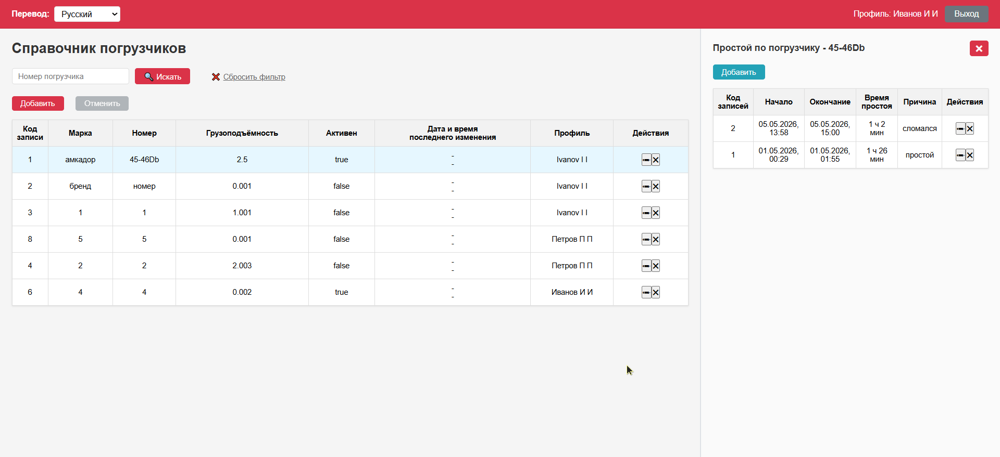
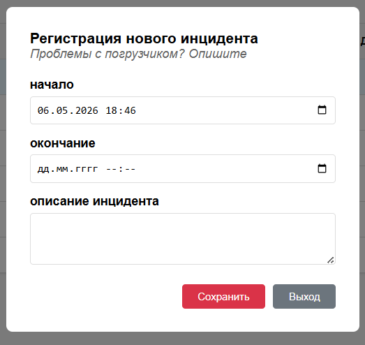

<p align="center">
  <h1 align="center">🚜 Forklift Directory</h1>
  <p align="center">Справочник погрузчиков — веб-приложение для учёта техники и простоев</p>
  <p align="center">
    
    
    
    
    
    
    
    
  </p>
</p>

---

## 📋 О проекте

Веб-приложение для управления справочником погрузчиков и учёта их простоев (инцидентов). Позволяет добавлять, редактировать и удалять записи о погрузчиках, а также регистрировать время простоев с указанием причины.

---

## 🛠 Стек технологий

### Backend
| Технология | Назначение |
|------------|-----------|
| **Java 14** | Язык программирования |
| **Spring Boot 2.7.14** | Фреймворк |
| **Spring Data JPA** | Работа с базой данных |
| **Spring Validation** | Валидация данных |
| **PostgreSQL** | База данных |
| **Flyway** | Миграции БД |
| **Lombok** | Генерация getter/setter/конструкторов |
| **Maven** | Сборка |

### Frontend
| Технология | Назначение |
|------------|-----------|
| **Vue 3** | Фреймворк |
| **Vite 4** | Сборщик |
| **Axios** | HTTP-клиент |
| **Vue Router** | Маршрутизация |

### Инфраструктура
| Технология | Назначение |
|------------|-----------|
| **Docker** | Контейнеризация (PostgreSQL + приложение) |
| **IntelliJ IDEA** | Среда разработки |

---

## 📁 Структура проекта

```
forklift-directory/
├── pom.xml                          # Родительский POM (Maven multi-module)
├── Dockerfile                       # Docker-сборка приложения
├── .dockerignore
├── .gitignore
├── LICENSE                          # Лицензия MIT
├── README.md                        # ← вы здесь
├── start.sh                         # Стартовый скрипт (Linux/macOS)
├── start.bat                        # Стартовый скрипт (Windows)
├── screen-main.png                  # Скриншот главного окна
├── screen-new-incident.png          # Скриншот окна инцидента
│
├── backend/                         # Java/Spring Boot бэкенд
│   ├── pom.xml
│   ├── create-project.ps1
│   ├── README_for_me.md
│   └── src/
│       ├── main/
│       │   ├── java/com/forklift/
│       │   │   ├── ForkliftApplication.java           # Точка входа Spring Boot
│       │   │   ├── controller/
│       │   │   │   ├── ForkliftController.java        # REST API для погрузчиков
│       │   │   │   └── DowntimeController.java        # REST API для простоев
│       │   │   ├── model/
│       │   │   │   ├── Forklift.java                  # Entity погрузчика
│       │   │   │   ├── Downtime.java                  # Entity простоя
│       │   │   │   └── dto/
│       │   │   │       ├── ForkliftDTO.java           # DTO для погрузчика
│       │   │   │       └── DowntimeDTO.java           # DTO для простоя
│       │   │   ├── repository/
│       │   │   │   ├── ForkliftRepository.java        # JPA репозиторий погрузчиков
│       │   │   │   └── DowntimeRepository.java        # JPA репозиторий простоев
│       │   │   ├── service/
│       │   │   │   ├── ForkliftService.java           # Интерфейс сервиса погрузчиков
│       │   │   │   ├── ForkliftServiceImpl.java       # Реализация сервиса погрузчиков
│       │   │   │   ├── DowntimeService.java           # Интерфейс сервиса простоев
│       │   │   │   └── DowntimeServiceImpl.java       # Реализация сервиса простоев
│       │   │   └── exception/
│       │   │       └── GlobalExceptionHandler.java    # Глобальный обработчик ошибок
│       │   └── resources/
│       │       ├── application.properties                       # Конфигурация Spring Boot (БД, порт)
│       │       └── db/migration/V1__create_forklift_tables.sql  # Миграция Flyway (создание таблиц)
│       └── test/
│           └── java/com/forklift/service/
│               ├── ForkliftServiceImplTest.java       # Unit-тесты (16 тестов)
│               └── DowntimeServiceImplTest.java       # Unit-тесты (11 тестов)
│
├── frontend/                        # Vue 3 фронтенд
│   ├── package.json
│   ├── vite.config.js
│   ├── index.html
│   └── src/
│       ├── main.js                            # Точка входа Vue
│       ├── App.vue                            # Корневой компонент
│       ├── api/index.js                       # API-клиент (axios, настройка)
│       ├── i18n/locales.js                    # Файл переводов (RU/EN)
│       ├── router/index.js                    # Маршрутизация
│       ├── views/
│       │   ├── ForkliftDirectory.vue          # Компонент (только шаблон)
│       │   └── forkliftLogic.js               # Логика компонента (data, methods, computed)
│       └── styles/
│           ├── main.css                       # Общие стили
│           └── forklift-directory.css         # Стили компонента
│
└── database/
    ├── init.sql                               # SQL-скрипт инициализации БД
    └── docker/                                # Docker-конфиг для БД
```

---

## ⚙️ Функциональность

### Справочник погрузчиков (основная таблица)

| Колонка | Описание |
|---------|----------|
| Код записи | ID погрузчика (автоинкремент) |
| Марка | Бренд/марка погрузчика |
| Номер | Уникальный номер погрузчика |
| Грузоподъёмность | Грузоподъёмность в тоннах |
| Активен | true/false — есть ли зарегистрированные простои |
| Дата и время последнего изменения | Автоматическая метка времени |
| Пользователь | Кто внёс изменения |
| Действия | Кнопки ✏ (редактировать), 💾 (сохранить), ✖ (удалить) |

### Основные операции

| Операция | Описание |
|----------|----------|
| **🔍 Искать** | Поиск погрузчиков по номеру (без учёта регистра) |
| **❌ Сбросить фильтр** | Очистить поиск и показать все записи (подчёркнутый текст) |
| **➕ Добавить** | Создать новую запись о погрузчике (доступно только авторизованным) |
| **✏ Изменить** | Перевести строку в режим редактирования |
| **💾 Сохранить** | Сохранить изменения в БД |
| **✖ Удалить** | Удалить запись (с подтверждением). Запрещено, если есть простои (код 409) |
| **↩ Отменить** | Отменить редактирование (с подтверждением) |

### Простои по погрузчику

- 📍 Отображаются в **правой панели (30% экрана)** после выбора строки
- 👁 Видны всем пользователям, редактирование — только авторизованным
- 📅 Сортировка: по дате-времени начала в обратном порядке (DESC)
- ❌ Крестик в заголовке панели или клавиша **Esc** — закрыть панель

### Колонка "Активен"

Показывает `true` если для погрузчика есть хотя бы один зарегистрированный простой, иначе `false`. Данные приходят с бэкенда при загрузке списка.

---

## 🌐 API Endpoints

### Погрузчики (`/api/forklifts`)

| Метод | URL | Описание |
|-------|-----|----------|
| `GET` | `/api/forklifts` | Получить список всех погрузчиков |
| `GET` | `/api/forklifts/search?number=` | Поиск по номеру (вхождение, регистронезависимый) |
| `GET` | `/api/forklifts/{id}` | Получить погрузчик по ID |
| `POST` | `/api/forklifts` | Создать новый погрузчик |
| `PUT` | `/api/forklifts/{id}` | Обновить погрузчик |
| `DELETE` | `/api/forklifts/{id}` | Удалить погрузчик (409 если есть простои) |

### Простои (`/api/downtimes`)

| Метод | URL | Описание |
|-------|-----|----------|
| `GET` | `/api/downtimes/forklift/{forkliftId}` | Получить список простоев по погрузчику |
| `POST` | `/api/downtimes` | Зарегистрировать новый простой |
| `PUT` | `/api/downtimes/{id}` | Обновить данные простоя |
| `DELETE` | `/api/downtimes/{id}` | Удалить запись о простое |

### Формат DTO

**ForkliftDTO:**
```json
{
  "id": 1,
  "brand": "Toyota",
  "number": "FT-001",
  "loadCapacity": 2.500,
  "isActive": true,
  "lastModified": "2026-05-05T14:30:00",
  "modifiedBy": "Иванов И И",
  "hasDowntimes": false
}
```

**DowntimeDTO:**
```json
{
  "id": 1,
  "forkliftId": 1,
  "startTime": "2026-05-05T10:00:00",
  "endTime": "2026-05-05T12:30:00",
  "description": "Неисправность двигателя",
  "createdAt": "2026-05-05T10:05:00",
  "downtimeDuration": "2 h 30 min"
}
```

---

## 🔐 Авторизация

Встроенная простая авторизация (без JWT/сессий):

| Логин | Пароль | Имя пользователя |
|-------|--------|------------------|
| `1` | `1` | **Иванов И И** |
| `2` | `2` | **Петров П П** |

- ✅ Авторизация сохраняется после перезагрузки страницы (`localStorage`)
- 🔴 Кнопка **Выход** — сбрасывает сессию
- 🛡 Редактирование/добавление/удаление доступно только авторизованным
- 👀 Просмотр данных доступен без авторизации

---

## 🌍 Интернационализация

- **Русский** / **Английский** — два языка интерфейса
- 🔄 Переключение через выпадающий список в верхней панели
- 📝 Переведены все надписи, кнопки, заголовки, сообщения и подсказки
- 📄 Файл переводов: `frontend/src/i18n/locales.js`

---

## 🧪 Тестирование

Всего **27 unit-тестов**, покрывающих основную бизнес-логику сервисов.

### ForkliftServiceImplTest (16 тестов)

| Метод | Тесты | Проверяется |
|-------|-------|-------------|
| `getAllForklifts` | 3 | Возврат всех записей, пустой список, поле `hasDowntimes` (true/false) |
| `searchByNumber` | 2 | Поиск по вхождению, пустой результат при отсутствии совпадений |
| `getForkliftById` | 2 | Успешное получение, EntityNotFoundException при отсутствии |
| `createForklift` | 3 | Сохранение записи, установка `isActive=true`, использование переданного `modifiedBy` |
| `updateForklift` | 2 | Обновление полей, EntityNotFoundException при отсутствии |
| `deleteForklift` | 3 | Успешное удаление, запрет при наличии простоев (409), EntityNotFoundException |

### DowntimeServiceImplTest (11 тестов)

| Метод | Тесты | Проверяется |
|-------|-------|-------------|
| `getDowntimesByForklift` | 3 | Возврат списка, пустой список, сортировка DESC по `startTime` |
| `createDowntime` | 2 | Сохранение простоя, EntityNotFoundException при отсутствии погрузчика |
| `updateDowntime` | 2 | Обновление причины, EntityNotFoundException при отсутствии |
| `deleteDowntime` | 2 | Успешное удаление, EntityNotFoundException при отсутствии |
| `convertToDTO` duration | 2 | Расчёт длительности с `endTime` и без (`endTime` = текущее время) |

---

## 🚀 Как запустить

### Быстрый старт (через скрипты)

```bash
# Linux/macOS
chmod +x start.sh
./start.sh              # полный запуск: БД + бэкенд + фронтенд
./start.sh --stop       # остановить всё
./start.sh --test       # запустить тесты

# Windows
start.bat               # полный запуск: БД + бэкенд + фронтенд
start.bat --stop        # остановить всё
start.bat --test        # запустить тесты
```

### Пошаговый запуск

#### 1. База данных (через Docker)

```bash
cd database/docker
docker-compose up -d
```

### 2. Бэкенд

```bash
cd backend
mvn clean package
java -jar target/forklift-directory-1.0.0.jar
```

Или через IntelliJ IDEA: запустить `ForkliftApplication.java`

### 3. Фронтенд

```bash
cd frontend
npm install
npm run dev
```

Приложение будет доступно: **http://localhost:5173**

### 4. Запуск тестов

```bash
cd backend
mvn test
```

---

## 📄 Лицензия

Распространяется под лицензией **MIT**. Подробнее — в файле [LICENSE](LICENSE).

---





---

<p align="center">
  <sub>Сделано с ❤️ для учёта погрузчиков</sub>
  <br>
  <sub>© 2026 ...</sub>
</p>